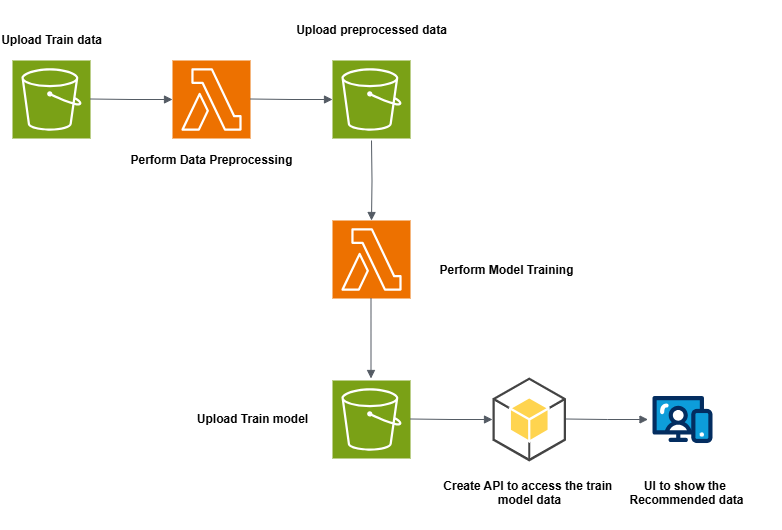

# Movies-Recommended-System-Core



#### Setup AWS SSO Config

```

C:\Users\YourName\YourProjectName> aws configure sso

SSO session name: aws_sso_session_name
SSO start URL: aws_sso_start_url
SSO Region: aws_sso_region
sso_registration_scopes: press Enter
CLI default Client Region: aws_region
CLI default output format: `json`
CLI profile name: aws_profile_name

```

#### Check the List of the AWS SSO profiles

```
C:\Users\YourName\YourProjectName> aws configure list-profiles
```

#### Set SSO Profile on env

```
C:\Users\YourName\YourProjectName> $env:AWS_PROFILE=aws_profile_name
```

#### Check the AWS SSO profile correct or not

```
C:\Users\YourName\YourProjectName>  aws sts get-caller-identity
```

#### AWS SSO Login

```
C:\Users\YourName\YourProjectName> aws sso login --profile aws_profile_name
```

#### Installation

```
C:\Users\YourName\YourProjectName> pip install -r requirements.txt
```

#### Find API Code on below github repository

### Find UI code on below github repository

